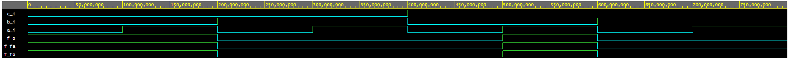
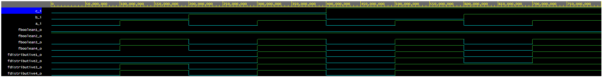
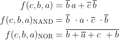

# Lab 1

### VHDL design.vhd code

For both verifications (De Morgan's law of function f(c,b,a) and Distributive law)

```vhdl
library ieee;               -- Standard library
use ieee.std_logic_1164.all;-- Package for data types and logic operations
------------------------------------------------------------------------
-- Entity declaration for basic gates
------------------------------------------------------------------------
entity gates is
    port(
        a_i    : in  std_logic;         -- Data input
        b_i    : in  std_logic;         -- Data input
        c_i	   : in  std_logic;			-- Data input
        f_o    : out std_logic;         -- output function
        f_fa   : out std_logic;         -- NAND output function
        f_fo   : out std_logic;         -- NOR output function
        fboolean1_o : out std_logic;         -- boolean output function
        fboolean2_o : out std_logic;         -- boolean output function
        fboolean3_o : out std_logic;         -- boolean output function
        fboolean4_o : out std_logic;         -- boolean output function
        fdistributive1_o : out std_logic;    -- distributive output function
        fdistributive2_o : out std_logic;    -- distributive output function
        fdistributive3_o : out std_logic;    -- distributive output function
        fdistributive4_o : out std_logic     -- distributive output function
    );
end entity gates;
------------------------------------------------------------------------
-- Architecture body for basic gates
------------------------------------------------------------------------
architecture dataflow of gates is
begin
    f_o   <= ((not b_i) and a_i) or ((not c_i) and (not b_i));
    f_fa  <= ((not b_i) nand a_i) nand ((not c_i) nand (not b_i));
    f_fo  <= not((b_i nor (not a_i)) nor (c_i nor b_i));
    fboolean1_o <= a_i and (not a_i);
    fboolean2_o <= a_i or (not a_i);
    fboolean3_o <= a_i or a_i or a_i;
    fboolean4_o <= a_i and a_i and a_i;
    fdistributive1_o <= (a_i and b_i) or (a_i and c_i);
    fdistributive2_o <= a_i and (b_i or c_i);
    fdistributive3_o <= (a_i or b_i) and (a_i or c_i);
    fdistributive4_o <= a_i or (b_i and c_i);
end architecture dataflow;
```

### Link to [EDA Playground](https://www.edaplayground.com/x/vGZd)

### Screenshot of simulated time waveform for De Morgans law



### Screenshot of simulated time waveform for Distributive law



### Function output table



| **c** | **b** |**a** | **f(c,b,a)** | **f(c,b,a)NAND** | **f(c,b,a)NOR** |
| :-: | :-: | :-: | :-: | :-: | :-: |
| 0 | 0 | 0 | 1 | 1 | 1 |
| 0 | 0 | 1 | 1 | 1 | 1 |
| 0 | 1 | 0 | 0 | 0 | 0 |
| 0 | 1 | 1 | 0 | 0 | 0 |
| 1 | 0 | 0 | 0 | 0 | 0 |
| 1 | 0 | 1 | 1 | 1 | 1 |
| 1 | 1 | 0 | 0 | 0 | 0 |
| 1 | 1 | 1 | 0 | 0 | 0 |
