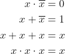
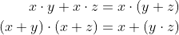

# Lab 1

### VHDL design.vhd code

For both verifications (De Morgan's law of function f(c,b,a) and Distributive law)

```vhdl
library ieee;               -- Standard library
use ieee.std_logic_1164.all;-- Package for data types and logic operations
------------------------------------------------------------------------
-- Entity declaration for basic gates
------------------------------------------------------------------------
entity gates is
    port(
        a_i    : in  std_logic;         -- Data input
        b_i    : in  std_logic;         -- Data input
        c_i	   : in  std_logic;			-- Data input
        f_o    : out std_logic;         -- output function
        f_fa   : out std_logic;         -- NAND output function
        f_fo   : out std_logic;         -- NOR output function
        fboolean1_o : out std_logic;         -- boolean output function
        fboolean2_o : out std_logic;         -- boolean output function
        fboolean3_o : out std_logic;         -- boolean output function
        fboolean4_o : out std_logic;         -- boolean output function
        fdistributive1_o : out std_logic;    -- distributive output function
        fdistributive2_o : out std_logic;    -- distributive output function
        fdistributive3_o : out std_logic;    -- distributive output function
        fdistributive4_o : out std_logic     -- distributive output function
    );
end entity gates;
------------------------------------------------------------------------
-- Architecture body for basic gates
------------------------------------------------------------------------
architecture dataflow of gates is
begin
    f_o   <= ((not b_i) and a_i) or ((not c_i) and (not b_i));
    f_fa  <= ((not b_i) nand a_i) nand ((not c_i) nand (not b_i));
    f_fo  <= not((b_i nor (not a_i)) nor (c_i nor b_i));
    fboolean1_o <= a_i and (not a_i);
    fboolean2_o <= a_i or (not a_i);
    fboolean3_o <= a_i or a_i or a_i;
    fboolean4_o <= a_i and a_i and a_i;
    fdistributive1_o <= (a_i and b_i) or (a_i and c_i);
    fdistributive2_o <= a_i and (b_i or c_i);
    fdistributive3_o <= (a_i or b_i) and (a_i or c_i);
    fdistributive4_o <= a_i or (b_i and c_i);
end architecture dataflow;
```

### Link to [EDA Playground](https://www.edaplayground.com/x/vGZd)

### Screenshot of simulated time waveform for De Morgans law


### Screenshot of simulated time waveform for De Morgans law


## Part 1: GitHub

GitHub is a code hosting platform for collaboration and version control. GitHub lets you (and others) work together on projects.

In GitHub, create a new public repository titled **Digital-electronics-1**. Initialize a README and [MIT license](https://choosealicense.com/licenses/mit/).

Use one of the available git manuals, such as [1](https://medium.com/swlh/how-to-make-the-perfect-readme-md-on-github-92ed5771c061), [2](https://help.github.com/en/articles/basic-writing-and-formatting-syntax), or [3](https://guides.github.com/features/mastering-markdown/), and add the following sections to your README file.

   * Headers
   * Emphasis (italics, bold)
   * Lists (ordered, unordered)
   * Links
   * Table
   * Listing of VHDL source code


## Part 2: Local repository

Run Git Bash (Windows) of Terminal (Linux) and create your own home folder inside `Documents`.

```bash
## Windows Git Bash:
$ cd d:/Documents/
$ mkdir your-name
$ cd your-name/

## Linux:
$ cd
$ cd Documents/
$ mkdir your-name
$ cd your-name/
```

With help of `git` command, clone a local copy of your public repository.

```bash
## Windows Git Bash or Linux:
$ git clone https://github.com/your-github-account/Digital-electronics-1
$ cd Digital-electronics-1/
$ ls
LICENSE  README.md
```

Download `Docs` folder from [this repository](https://github.com/tomas-fryza/Digital-electronics-1) and copy it to your `Digital-electronics-1` local repository.

```bash
## Windows Git Bash or Linux:
$ ls
Docs  LICENSE  README.md
```

Create a new working folder `Labs/01-gates` for this exercise.

```bash
## Windows Git Bash or Linux:
$ mkdir Labs
$ cd Labs/
$ mkdir 01-gates
```


## Part 3: EDA Playground

Open the [Example of basic gates](https://www.edaplayground.com/x/5L92). Take a look at the basic parts of the VHDL source code, such as [entity](https://github.com/tomas-fryza/Digital-electronics-1/wiki/Entity), [architecture](https://github.com/tomas-fryza/Digital-electronics-1/wiki/Architecture), and testbench. Use button **Run** to run the simulation and log in to your account using **Log In (save edits)**.

Most common VHDL operators are shown in the table.

| **Operator** | **Description** |
| :-: | :-- |
| `<=` | Value assignment |
| `and` | Logical AND |
| `nand` | Logical AND with negated output |
| `or` | Logical OR |
| `nor` | Logical OR with negated output |
| `not` | Nagation |
| `xor` | Exclusive OR |
| `xnor` | Exclusive OR with negated output |
| `-- comment` | Comments |

Use De Morgan's laws and modify the following logic function to the form with NAND and NOR gates only. Verify all three functions in EDA Playground tool.


> Note that, equations were generated by [Online LaTeX Equation Editor](https://www.codecogs.com/latex/eqneditor.php) using the following code.
```LaTeX
\begin{align*}
    f(c,b,a) =&~ \overline{b}\,a + \overline{c}\,\overline{b}\\
    f(c,b,a)_{\textup{NAND}} =&\\
    f(c,b,a)_{\textup{NOR}} =&\\
\end{align*}
```
>

Run any text editor, such as *Visual Studio Code* or *Atom*, open/create your `Digital-electronics-1/Labs/01-gates/README.md` local file (not on GitHub), complete tables with logical values, add link to your Playground and a screenshot with time waveforms from the simulator.

| **c** | **b** |**a** | **f(c,b,a)** |
| :-: | :-: | :-: | :-: |
| 0 | 0 | 0 |  |
| 0 | 0 | 1 |  |
| 0 | 1 | 0 |  |
| 0 | 1 | 1 |  |
| 1 | 0 | 0 |  |
| 1 | 0 | 1 |  |
| 1 | 1 | 0 |  |
| 1 | 1 | 1 |  |


## Synchronize git

When you finish working, always synchronize the contents of your working folder with the local and remote versions of your repository. This way you are sure that you will not lose any of your changes.

Use [git commands](https://github.com/tomas-fryza/Digital-electronics-1/wiki/Git-useful-commands) to add, commit, and push all local changes to your remote repository. Note that, a detailed description of all git commands can be found [here](https://github.com/joshnh/Git-Commands). Check the repository at GitHub web page for changes.

```bash
## Windows Git Bash or Linux:
$ git status
$ git add <your-modified-files>
$ git status
$ git commit -m "[LAB] Creating 01-gates lab"
$ git status
$ git push
$ git status
```


## Experiments on your own

1. In EDA Playground, verify basic Boolean postulates:



2. In EDA Playground, verify Distributive laws:



3. Try several online graphics simulators, such as [CircuitVerse](https://circuitverse.org/), [Logicly](https://logic.ly/), [CircuitLab](https://www.circuitlab.com/), [simulatorIO](https://simulator.io/), [LogicEmu](https://lodev.org/logicemu/), and compare their options.


## Lab assignment

1. Submit the GitHub link to your `Digital-electronics-1` repository.

2. Verification of De Morgan's laws of function f(c,b,a). Submit:
    * Listing of VHDL code `design.vhd`,
    * Screenshot with simulated time waveforms,
    * Link to your public EDA Playground example.

3. Verification of Distributive laws. Submit:
    * Listing of VHDL code `design.vhd`,
    * Screenshot with simulated time waveforms,
    * Link to your public EDA Playground example.

*Prepare all tasks in your README file `Digital-electronics-1/Labs/01-gates/README.md`, export/print it to PDF, use [BUT e-learning](https://moodle.vutbr.cz/) web page and submit a single PDF file. The deadline for submitting the task is the day before the next laboratory exercise.*
