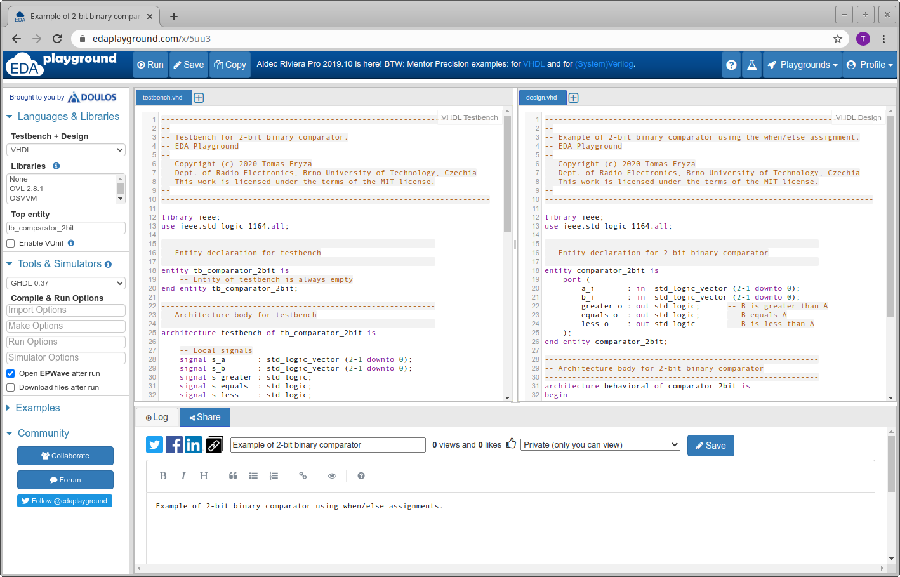
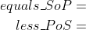
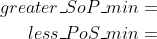

# LAB 1

### VHDL design.vhd code for 4-bit comparator

```vhdl
library ieee;
use ieee.std_logic_1164.all;

------------------------------------------------------------------------
-- Entity declaration for 4-bit binary comparator
------------------------------------------------------------------------
entity comparator_4bit is
    port(
        a_i           : in  std_logic_vector(4 - 1 downto 0);
        b_i           : in  std_logic_vector(4 - 1 downto 0);
        -- COMPLETE ENTITY DECLARATION
		B_equals_A_o  : out std_logic;       -- B equals A
		B_greater_A_o : out std_logic;       -- B is greater than A
        B_less_A_o    : out std_logic        -- B is less than A
    );
end entity comparator_4bit;
------------------------------------------------------------------------
-- Architecture body for 4-bit binary comparator
------------------------------------------------------------------------
architecture Behavioral of comparator_4bit is
begin
    B_equals_A_o   <= '1' when (b_i = a_i) else '0';
    B_greater_A_o  <= '1' when (b_i > a_i) else '0';
    B_less_A_o     <= '1' when (b_i < a_i) else '0';
end architecture Behavioral;
```
### VHDL testbench.vhd code for 4-bit comparator

```vhdl
library ieee;
use ieee.std_logic_1164.all;
------------------------------------------------------------------------
-- Entity declaration for testbench
------------------------------------------------------------------------
entity tb_comparator_4bit is
    -- Entity of testbench is always empty
end entity tb_comparator_4bit;
------------------------------------------------------------------------
-- Architecture body for testbench
------------------------------------------------------------------------
architecture testbench of tb_comparator_4bit is
    -- Local signals
    signal s_a       : std_logic_vector(4 - 1 downto 0);
    signal s_b       : std_logic_vector(4 - 1 downto 0);
    signal s_B_greater_A : std_logic;
    signal s_B_equals_A  : std_logic;
    signal s_B_less_A    : std_logic;
begin
    -- Connecting testbench signals with comparator_2bit entity (Unit Under Test)
    uut_comparator_4bit : entity work.comparator_4bit
        port map(
            a_i           => s_a,
            b_i           => s_b,
            B_greater_A_o => s_B_greater_A,
            B_equals_A_o  => s_B_equals_A,
            B_less_A_o    => s_B_less_A
        );
    --------------------------------------------------------------------
    -- Data generation process
    --------------------------------------------------------------------
    p_stimulus : process
    begin
        -- Report a note at the begining of stimulus process
        report "Stimulus process started" severity note;
        
        -- First test values
        s_b <= "0000"; s_a <= "0000"; wait for 100 ns;
        -- Expected output
        assert ((s_B_greater_A = '0') and (s_B_equals_A = '1') and (s_B_less_A = '0'))
        -- If false, then report an error
        report "Test failed for input combination: 0000, 0000" severity error;
        
        -- Second test values
        s_b <= "0000"; s_a <= "0001"; wait for 100 ns;
        -- Expected output
        assert ((s_B_greater_A = '0') and (s_B_equals_A = '0') and (s_B_less_A = '1'))
        -- If false, then report an error
        report "Test failed for input combination: 0000, 0001" severity error;
        
        -- Third test values
        s_b <= "0000"; s_a <= "0010"; wait for 100 ns;
        -- Expected output
        assert ((s_B_greater_A = '0') and (s_B_equals_A = '0') and (s_B_less_A = '1'))
        -- If false, then report an error
        report "Test failed for input combination: 0000, 0010" severity error;
        
        -- Fourth test values
        s_b <= "0000"; s_a <= "0011"; wait for 100 ns;
        -- Expected output
        assert ((s_B_greater_A = '0') and (s_B_equals_A = '0') and (s_B_less_A = '1'))
        -- If false, then report an error
        report "Test failed for input combination: 0000, 0011" severity error;
        
        -- Fifth test values
        s_b <= "0001"; s_a <= "0000"; wait for 100 ns;
        -- Expected output
        assert ((s_B_greater_A = '1') and (s_B_equals_A = '0') and (s_B_less_A = '0'))
        -- If false, then report an error
        report "Test failed for input combination: 0001, 0000" severity error;
        
        -- Sixth test values
        s_b <= "0001"; s_a <= "0001"; wait for 100 ns;
        -- Expected output
        assert ((s_B_greater_A = '0') and (s_B_equals_A = '1') and (s_B_less_A = '0'))
        -- If false, then report an error
        report "Test failed for input combination: 0001, 0001" severity error;
        
        -- Seventh test values
        s_b <= "0001"; s_a <= "0010"; wait for 100 ns;
        -- Expected output
        assert ((s_B_greater_A = '0') and (s_B_equals_A = '0') and (s_B_less_A = '1'))
        -- If false, then report an error
        report "Test failed for input combination: 0001, 0010" severity error;
        
        -- Eighth test values
        s_b <= "0001"; s_a <= "0011"; wait for 100 ns;
        -- Expected output
        assert ((s_B_greater_A = '0') and (s_B_equals_A = '0') and (s_B_less_A = '1'))
        -- If false, then report an error
        report "Test failed for input combination: 0001, 0011" severity error;
        
        -- Ninenth test values
        s_b <= "0010"; s_a <= "0000"; wait for 100 ns;
        -- Expected output
        assert ((s_B_greater_A = '1') and (s_B_equals_A = '0') and (s_B_less_A = '0'))
        -- If false, then report an error
        report "Test failed for input combination: 0010, 0000" severity error;
        
        -- Tenth test values
        s_b <= "0010"; s_a <= "0001"; wait for 100 ns;
        -- Expected output
        assert ((s_B_greater_A = '1') and (s_B_equals_A = '0') and (s_B_less_A = '0'))
        -- If false, then report an error
        report "Test failed for input combination: 0010, 0001" severity error;
        
        -- Eleventh failed test values
        s_b <= "0000"; s_a <= "1111"; wait for 100 ns;
        -- Expected output
        assert ((s_B_greater_A = '0') and (s_B_equals_A = '1') and (s_B_less_A = '0'))
        -- If false, then report an error
        report "Test failed for input combination: 0000, 1111" severity error;
        
        -- Report a note at the end of stimulus process
        report "Stimulus process finished" severity note;
        wait;
    end process p_stimulus;
end architecture testbench;
```
### Link to [EDA Playground](https://www.edaplayground.com/x/W53R)

### Simulator console output

```
[2021-02-17 08:44:01 EST] ghdl -i design.vhd testbench.vhd  && ghdl -m  tb_comparator_4bit && ghdl -r  tb_comparator_4bit   --vcd=dump.vcd && sed -i 's/^U/X/g; s/^-/X/g; s/^H/1/g; s/^L/0/g' dump.vcd 
analyze design.vhd
analyze testbench.vhd
elaborate tb_comparator_4bit
testbench.vhd:51:9:@0ms:(report note): Stimulus process started
testbench.vhd:127:9:@1100ns:(assertion error): Test failed for input combination: 0000, 1111
testbench.vhd:133:9:@1100ns:(report note): Stimulus process finished
Finding VCD file...
./dump.vcd
[2021-02-17 08:44:02 EST] Opening EPWave...
Done
```


### Screenshot of simulated time waveform for Boolean postulates and Distributive law


### Function output table
# Lab 2: Combinational logic

### Learning objectives

The purpose of this laboratory exercise is to learn to use different ways of writing combination functions (truth table, K-map, SoP/PoS forms), their minimization, the use of signal assignments in VHDL, and assertion statements in VHDL testbench.




## Preparation tasks (done before the lab at home)

*Digital* or *Binary comparator* compares the digital signals A, B presented at input terminal and produce outputs depending upon the condition of those inputs. Complete the truth table for 2-bit *Identity comparator* (B equals A), and two *Magnitude comparators* (B is greater than A, B is less than A). Note that, such a digital device has four inputs and three outputs/functions.

| **Dec. equivalent** | **B[1:0]** | **A[1:0]** | **B is greater than A** | **B equals A** | **B is less than A** |
| :-: | :-: | :-: | :-: | :-: | :-: |
| 0 | 0 0 | 0 0 | 0 | 1 | 0 |
| 1 | 0 0 | 0 1 | 0 | 0 | 1 |
| 2 | 0 0 | 1 0 | 0 | 0 | 1 |
| 3 | 0 0 | 1 1 | 0 | 0 | 1 |
| 4 | 0 1 | 0 0 | 1 | 0 | 0 |
| 5 | 0 1 | 0 1 | 0 | 1 | 0 |
| 6 | 0 1 | 1 0 | 0 | 0 | 1 |
| 7 | 0 1 | 1 1 | 0 | 0 | 1 |
| 8 | 1 0 | 0 0 | 1 | 0 | 0 |
| 9 | 1 0 | 0 1 | 1 | 0 | 0 |
| 10 | 1 0 | 1 0 | 0 | 1 | 0 |
| 11 | 1 0 | 1 1 | 0 | 0 | 1 |
| 12 | 1 1 | 0 0 | 1 | 0 | 0 |
| 13 | 1 1 | 0 1 | 1 | 0 | 0 |
| 14 | 1 1 | 1 0 | 1 | 0 | 0 |
| 15 | 1 1 | 1 1 | 0 | 1 | 0 |

According to the truth table, write canonical SoP (Sum of Products) and PoS (Product of Sums) forms for "equals" and "less than" functions:



## Part 2: Logic function minimization

*[Karnaugh Maps](https://learnabout-electronics.org/Digital/dig24.php) (or K-maps) offer a graphical method of reducing a digital circuit to its minimum number of gates. The map is a simple table containing 1s and 0s that can express a truth table or complex Boolean expression describing the operation of a digital circuit.*

The K-map for the "equals" function is as follows:


Create K-maps for other two functions.

&nbsp;

&nbsp;

&nbsp;

&nbsp;

&nbsp;

&nbsp;

Use K-maps to create a simplified SoP form of the "greater than" function and a PoS form of the "less than" function.



 
 ## Part 3: Binary comparator in VHDL language

Log in to your [EDA Playground](https://www.edaplayground.com/login) account and create a new project: you can copy your previous playground and save it under a different name.

In VHDL, define an [entity](https://github.com/tomas-fryza/Digital-electronics-1/wiki/Entity) for a 2-bit binary comparator (`comparator_2bit`).

| **Port name** | **Direction** | **Type** | **Description** |
| :-: | :-: | :-- | :-- |
| `a_i`       | input  | [`std_logic_vector(2 - 1 downto 0)`](https://github.com/tomas-fryza/Digital-electronics-1/wiki/Data-types) | Data A |
| `b_i`       | input  | `std_logic_vector(2 - 1 downto 0)` | Data B |
| `greater_o` | output | `std_logic` | B is greater than A |
| `equals_o`  | output | `std_logic` | B equals A |
| `less_o`    | output | `std_logic` | B is less than A |

In VHDL, define an [architecture](https://github.com/tomas-fryza/Digital-electronics-1/wiki/Architecture) for a 2-bit binary comparator. The combination logic can be written using low-level operators (`and`, `or`, etc.) as in the previous laboratory exercise. However, it is more efficient to use a higher notation with [signal assignments](https://github.com/tomas-fryza/Digital-electronics-1/wiki/Signal-assignments). Use the assignment `when`,` else` to describe the three output functions, such as:

```vhdl
greater_o <= '1' when (b_i > a_i) else '0';
```


## Part 4: Assertion statements in VHDL testbench

You can write any information to the console using the report statement. The basic syntax in VHDL is:

```vhdl
report <message_string> [severity <severity_level>];
```

where possible values for `severity_level` are: `note`, `warning`, `error`, `failure`. If the severity level is omitted, then the default value is `note`.

An assertion statement checks that a specified condition is true and reports an error if it is not. It is combined with a report statement as follows:

```vhdl
assert (<condition>)
report <message_string>
[severity <severity_level>];
```

The message is displayed to the console when the condition is NOT met, therefore the message should be an opposite to the condition.

```vhdl
    --------------------------------------------------------------------
    -- Data generation process
    --------------------------------------------------------------------
    p_stimulus : process
    begin
        report "Stimulus process started" severity note;

        s_b <= "00";
        s_a <= "00";
        wait for 100 ns;
        -- Expected output
        assert ((s_greater = '0') and (s_equals = '1') and (s_less = '0'))
        -- If false, report an error
        report "Test failed for input combination: 00, 00"
        severity error;

        -- ADD OTHER TEST CASES

        report "Stimulus process finished" severity note;
        wait;
    end process p_stimulus;
```

In VHDL, write a testbench and verify the correct functionality of the comparator for all input combinations.

Update your local (not GitHub) `README.md` file with a screenshot of the simulation(s) and a link to your public EDA playground.


## Synchronize git

Use [git commands](https://github.com/tomas-fryza/Digital-electronics-1/wiki/Git-useful-commands) to add, commit, and push all local changes to your remote repository. Check the repository at GitHub web page for changes.


## Experiments on your own

1. In EDA Playground, define entity and architecture for a 4-bit binary comparator (`comparator_4bit`).

   | **Port name** | **Direction** | **Type** | **Description** |
   | :-: | :-: | :-- | :-- |
   | `a_i`       | input  | `std_logic_vector(4 - 1 downto 0)` | Data A |
   | `b_i`       | input  | `std_logic_vector(4 - 1 downto 0)` | Data B |
   | `greater_o` | output | `std_logic` | B is greater than A |
   | `equals_o`  | output | `std_logic` | B equals A |
   | `less_o`    | output | `std_logic` | B is less than A |

2. In VHDL, define a testbench for a 4-bit binary comparator. Verify at least ten random input combinations.


## Lab assignment

1. Preparation tasks (done before the lab at home). Submit:
   * Binary comparator truth table.

2. A 4-bit binary comparator. Submit:
   * VHDL code (`design.vhd`),
   * VHDL testbench (`testbench.vhd`),
   * Screenshot with simulated time waveforms,
   * Link to your public EDA Playground example.

The deadline for submitting the task is the day before the next laboratory exercise. Use [BUT e-learning](https://moodle.vutbr.cz/) web page and submit a single PDF file.
