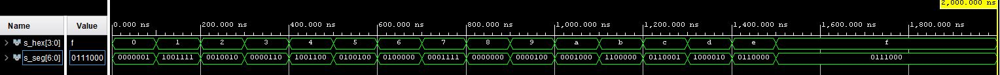
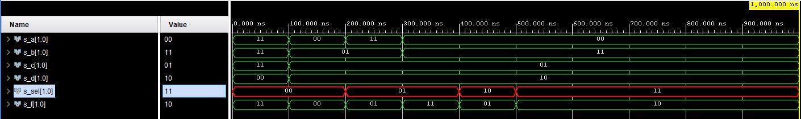

# LAB 4

## First task

### Table with connection of 7-segment displays on Nexys A7 board

| **Component** | **Resistor [Ω]** | **PIN** | 
| :-: | :-: | :-: |
| AN0 | 2K2 | J17 | 
| AN1 | 2K2 | J18 | 
| AN2 | 2K2 | T9 | 
| AN3 | 2K2 | J14 | 
| AN4 | 2K2 | P14 | 
| AN5 | 2K2 | T14 | 
| AN6 | 2K2 | K2 | 
| AN7 | 2K2 | U13 | 
| CA | 100 | T10 |
| CB | 100 | R10 |
| CC | 100 | K16 | 
| CD | 100 | K13 | 
| CE | 100 | P15 |
| CF | 100 | T11 | 
| CG | 100 | L18 | 
| DP | 100 | H15 | 
| SW0 | 10K | J15 |
| SW1 | 10K | L16 |
| SW2 | 10K | M13 | 
| SW3 | 10K | R15 |
| LED0(high) | 330 | H17 |
| LED1(high) | 330 | K15 |
| LED2(high) | 330 | J13 |
| LED3(high) | 330 | N14 |

### Decoder truth table for common anode 7-segment display

| **Hex** | **Inputs** | **A** | **B** | **C** | **D** | **E** | **F** | **G** |
| :-: | :-: | :-: | :-: | :-: | :-: | :-: | :-: | :-: |
| 0 | 0000 | 0 | 0 | 0 | 0 | 0 | 0 | 1 |
| 1 | 0001 | 1 | 0 | 0 | 1 | 1 | 1 | 1 |
| 2 | 0010 | 0 | 0 | 1 | 0 | 0 | 1 | 0 |
| 3 | 0011 | 0 | 0 | 0 | 0 | 1 | 1 | 0 |
| 4 | 0100 | 1 | 0 | 0 | 1 | 1 | 0 | 0 |
| 5 | 0101 | 0 | 1 | 0 | 0 | 1 | 0 | 0 |
| 6 | 0110 | 0 | 1 | 0 | 0 | 0 | 0 | 0 |
| 7 | 0111 | 0 | 0 | 0 | 1 | 1 | 1 | 1 |
| 8 | 1000 | 0 | 0 | 0 | 0 | 0 | 0 | 0 |
| 9 | 1001 | 0 | 0 | 0 | 0 | 1 | 0 | 0 |
| A | 1010 | 0 | 0 | 0 | 1 | 0 | 0 | 0 |
| b | 1011 | 1 | 1 | 0 | 0 | 0 | 0 | 0 |
| C | 1100 | 0 | 1 | 1 | 0 | 0 | 0 | 1 |
| d | 1101 | 1 | 0 | 0 | 0 | 0 | 1 | 0 |
| E | 1110 | 0 | 1 | 1 | 0 | 0 | 0 | 0 |
| F | 1111 | 0 | 1 | 1 | 1 | 0 | 0 | 0 |

## Second task

### Listing of VHDL architecture from source file hex_7seg.vhd with syntax highlighting

```vhdl
architecture behavioral of hex_7seg is
begin
    --------------------------------------------------------------------
    -- p_7seg_decoder:
    -- A combinational process for 7-segment display decoder. 
    -- Any time "hex_i" is changed, the process is "executed".
    -- Output pin seg_o(6) corresponds to segment A, seg_o(5) to B, etc.
    --------------------------------------------------------------------
    p_7seg_decoder : process(hex_i)
    begin
        case hex_i is
            when "0000" =>
                seg_o <= "0000001";     -- 0
            when "0001" =>
                seg_o <= "1001111";     -- 1
            when "0010" =>
                seg_o <= "0010010";     -- 2
            when "0011" =>
                seg_o <= "0000110";     -- 3
            when "0100" =>
                seg_o <= "1001100";     -- 4
            when "0101" =>
                seg_o <= "0100100";     -- 5
            when "0110" =>
                seg_o <= "0100000";     -- 6
            when "0111" =>
                seg_o <= "0001111";     -- 7
            when "1000" =>
                seg_o <= "0000000";     -- 8
            when "1001" =>
                seg_o <= "0000100";     -- 9
            when "1010" =>
                seg_o <= "0001000";     -- A
            when "1011" =>
                seg_o <= "1100000";     -- b
            when "1100" =>
                seg_o <= "0110001";     -- C
            when "1101" =>
                seg_o <= "1000010";     -- d
            when "1110" =>
                seg_o <= "0110000";     -- E
            when others =>
                seg_o <= "0111000";     -- F
        end case;
    end process p_7seg_decoder;
end architecture behavioral;
```

### Listing of VHDL stimulus process from testbench file tb_hex_7seg.vhd with syntax highlighting and asserts

```vhdl
    p_stimulus : process
    begin
        -- Report a note at the begining of stimulus process
        report "Stimulus process started" severity note;

        s_hex <= "0000"; wait for 100 ns;       -- 0
        s_hex <= "0001"; wait for 100 ns;       -- 1
        s_hex <= "0010"; wait for 100 ns;       -- 2
        s_hex <= "0011"; wait for 100 ns;       -- 3
        s_hex <= "0100"; wait for 100 ns;       -- 4
        s_hex <= "0101"; wait for 100 ns;       -- 5
        s_hex <= "0110"; wait for 100 ns;       -- 6
        s_hex <= "0111"; wait for 100 ns;       -- 7
        s_hex <= "1000"; wait for 100 ns;       -- 8
        s_hex <= "1001"; wait for 100 ns;       -- 9
        s_hex <= "1010"; wait for 100 ns;       -- A
        s_hex <= "1011"; wait for 100 ns;       -- b
        s_hex <= "1100"; wait for 100 ns;       -- C
        s_hex <= "1101"; wait for 100 ns;       -- d
        s_hex <= "1110"; wait for 100 ns;       -- E
        s_hex <= "1111"; wait for 100 ns;       -- F

        -- Report a note at the end of stimulus process
        report "Stimulus process finished" severity note;
        wait;
    end process p_stimulus;
```

### Screenshot with simulated time waveforms; always display all inputs and outputs



### Listing of VHDL code from source file top.vhd with 7-segment module instantiation

```vhdl

```

## Third task

### Truth table and listing of VHDL code for LEDs(7:4) with syntax highlighting

| **Hex** | **Inputs** | **LED4** | **LED5** | **LED6** | **LED7** |
| :-: | :-: | :-: | :-: | :-: | :-: |
| 0 | 0000 |  |  |  |  |
| 1 | 0001 |  |  |  |  |
| 2 |      |  |  |  |  |
| 3 |      |  |  |  |  |
| 4 |      |  |  |  |  |
| 5 |      |  |  |  |  |
| 6 |      |  |  |  |  |
| 7 |      |  |  |  |  |
| 8 | 1000 |  |  |  |  |
| 9 |      |  |  |  |  |
| A |      |  |  |  |  |
| b |      |  |  |  |  |
| C |      |  |  |  |  |
| d |      |  |  |  |  |
| E | 1110 |  |  |  |  |
| F | 1111 |  |  |  |  |

### Screenshot with simulated time waveforms; always display all inputs and outputs


