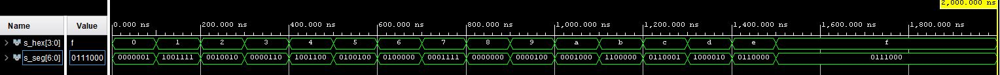
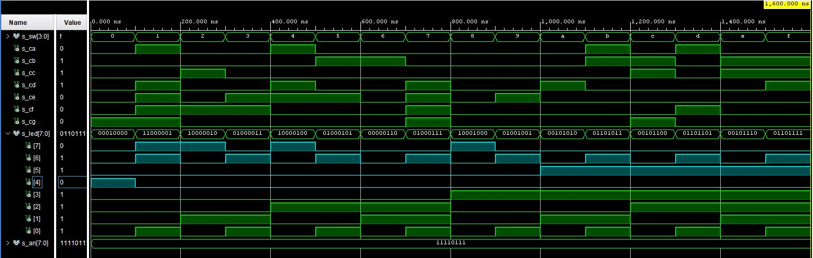

# LAB 5

## First task

### Table with connection of push buttons on Nexys A7 board

| **Component** | **Resistor [Ω]** | **PIN** | 
| :-: | :-: | :-: |
| AN0 | 2K2 | J17 | 
| AN1 | 2K2 | J18 | 
| AN2 | 2K2 | T9 | 
| AN3 | 2K2 | J14 | 
| AN4 | 2K2 | P14 | 
| AN5 | 2K2 | T14 | 
| AN6 | 2K2 | K2 | 
| AN7 | 2K2 | U13 | 
| CA | 100 | T10 |
| CB | 100 | R10 |
| CC | 100 | K16 | 
| CD | 100 | K13 | 
| CE | 100 | P15 |
| CF | 100 | T11 | 
| CG | 100 | L18 | 
| DP | 100 | H15 | 
| SW0 | 10K | J15 |
| SW1 | 10K | L16 |
| SW2 | 10K | M13 | 
| SW3 | 10K | R15 |
| LED0(high) | 330 | H17 |
| LED1(high) | 330 | K15 |
| LED2(high) | 330 | J13 |
| LED3(high) | 330 | N14 |
| LED4(high) | 330 | R18 |
| LED5(high) | 330 | V17 |
| LED6(high) | 330 | U17 |
| LED7(high) | 330 | U16 |

### Table with calculated values

| **Hex** | **Inputs** | **A** | **B** | **C** | **D** | **E** | **F** | **G** |
| :-: | :-: | :-: | :-: | :-: | :-: | :-: | :-: | :-: |
| 0 | 0000 | 0 | 0 | 0 | 0 | 0 | 0 | 1 |
| 1 | 0001 | 1 | 0 | 0 | 1 | 1 | 1 | 1 |
| 2 | 0010 | 0 | 0 | 1 | 0 | 0 | 1 | 0 |
| 3 | 0011 | 0 | 0 | 0 | 0 | 1 | 1 | 0 |
| 4 | 0100 | 1 | 0 | 0 | 1 | 1 | 0 | 0 |
| 5 | 0101 | 0 | 1 | 0 | 0 | 1 | 0 | 0 |
| 6 | 0110 | 0 | 1 | 0 | 0 | 0 | 0 | 0 |
| 7 | 0111 | 0 | 0 | 0 | 1 | 1 | 1 | 1 |
| 8 | 1000 | 0 | 0 | 0 | 0 | 0 | 0 | 0 |
| 9 | 1001 | 0 | 0 | 0 | 0 | 1 | 0 | 0 |
| A | 1010 | 0 | 0 | 0 | 1 | 0 | 0 | 0 |
| b | 1011 | 1 | 1 | 0 | 0 | 0 | 0 | 0 |
| C | 1100 | 0 | 1 | 1 | 0 | 0 | 0 | 1 |
| d | 1101 | 1 | 0 | 0 | 0 | 0 | 1 | 0 |
| E | 1110 | 0 | 1 | 1 | 0 | 0 | 0 | 0 |
| F | 1111 | 0 | 1 | 1 | 1 | 0 | 0 | 0 |

## Second task

### Listing of VHDL code of the process p_cnt_up_down with syntax highlighting

```vhdl

```

### Listing of VHDL reset and stimulus processes from testbench file tb_cnt_up_down.vhd with syntax highlighting and asserts

```vhdl

```

### Screenshot with simulated time waveforms



## Third task

### Listing of VHDL code from source file top.vhd with all instantiations for the 4-bit bidirectional counter

```vhdl

```

### Image of the top layer including both counters, ie a 4-bit bidirectional counter from Part 4 and a 16-bit counter with a different time base from Part Experiments on your own


