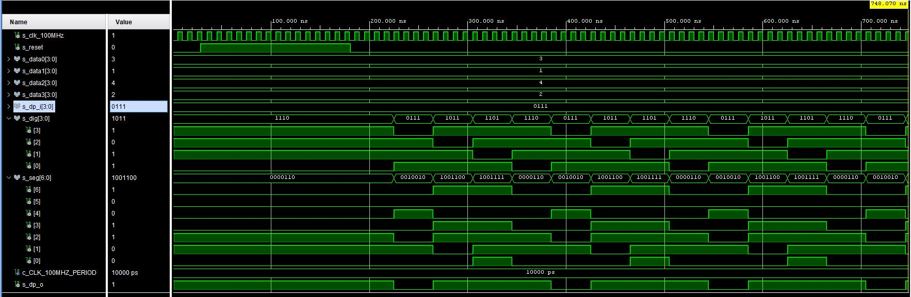

# LAB 6

## First task

### Timing diagram figure for displaying value 3.142


## Second task

### Listing of VHDL code of the process p_mux with syntax highlighting

```vhdl

```

### Listing of VHDL testbench file tb_driver_7seg_4digits with syntax highlighting and asserts

```vhdl

```

### Screenshot with simulated time waveforms; always display all inputs and outputs



### Listing of VHDL architecture of the top layer

```vhdl

```

## Third task

### Image of the driver schematic. The image can be drawn on a computer or by hand


