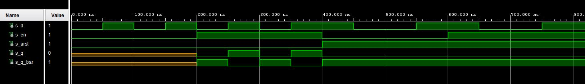
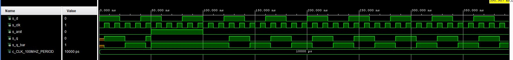
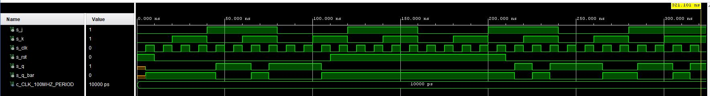
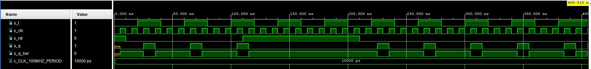
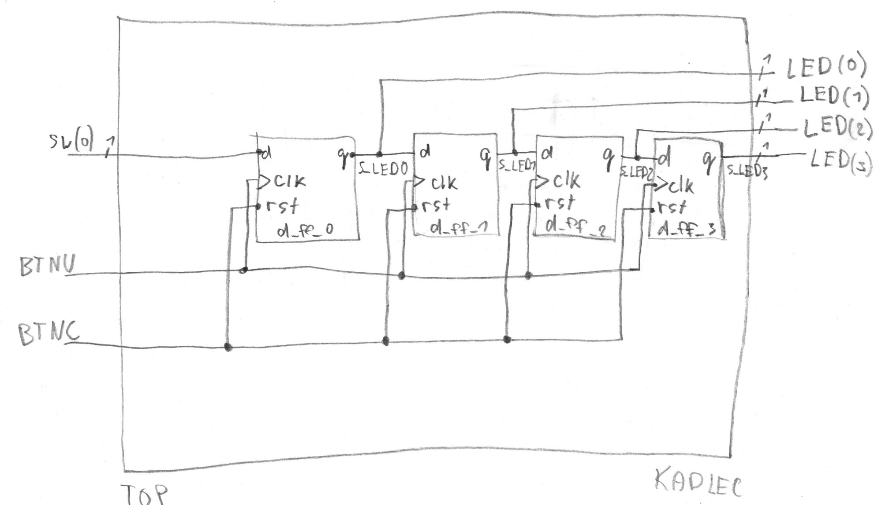

# LAB 7

## First task

### Timing diagram figure for displaying value 3.142

   | **D** | **Qn** | **Q(n+1)** | **Comments** |
   | :-: | :-: | :-: | :-- |
   | 0 | 0 | 0 | No change |
   | 0 | 1 | 0 | Reset |
   | 1 | 0 | 1 | No change |
   | 1 | 1 | 1 | Set |

   | **J** | **K** | **Qn** | **Q(n+1)** | **Comments** |
   | :-: | :-: | :-: | :-: | :-- |
   | 0 | 0 | 0 | 0 | No change |
   | 0 | 0 | 1 | 1 | No change |
   | 0 | 1 | 0 | 0 | Reset |
   | 0 | 1 | 1 | 0 | Reset |
   | 1 | 0 | 0 | 1 | Set |
   | 1 | 0 | 1 | 1 | Set |
   | 1 | 1 | 0 | 1 | Toggle |
   | 1 | 1 | 1 | 0 | Toggle |

   | **T** | **Qn** | **Q(n+1)** | **Comments** |
   | :-: | :-: | :-: | :-- |
   | 0 | 0 | 0 | No change |
   | 0 | 1 | 1 | No change |
   | 1 | 0 | 1 | Invert (toggle) |
   | 1 | 1 | 0 | Invert (toggle) |

## Second task

### VHDL code listing of the process p_d_latch with syntax highlighting

```vhdl
    p_d_latch : process(en, d, arst)
    begin
        if (arst = '1') then
            q     <= '0';
            q_bar <= '1';
        elsif (en = '1') then
            q     <= d;
            q_bar <= not d;
        end if;
    end process p_d_latch;
```

### Listing of VHDL reset and stimulus processes from the testbench tb_d_latch file with syntax highlighting and asserts

```vhdl
    p_stimulus : process
    begin
        report "Stimulus process started" severity note;

        s_arst <= '0';
        s_en   <= '0'; 
        s_d    <= '0'; wait for 50 ns;
        s_d    <= '1'; wait for 50 ns;
        s_d    <= '0'; wait for 50 ns;
        s_d    <= '1'; wait for 50 ns;
        
        s_en   <= '1'; 
        s_d    <= '0'; wait for 50 ns;
        s_d    <= '1'; wait for 50 ns;
        s_d    <= '0'; wait for 50 ns;
        s_d    <= '1'; wait for 50 ns;
        
        s_arst <= '1';
        s_en   <= '0'; 
        s_d    <= '1'; wait for 50 ns;
        s_d    <= '0'; wait for 50 ns;
        s_d    <= '0'; wait for 50 ns;
        s_d    <= '1'; wait for 50 ns;
        
        s_en   <= '1';
        s_d    <= '1'; wait for 50 ns;
        s_d    <= '0'; wait for 50 ns;
        s_d    <= '0'; wait for 50 ns;
        s_d    <= '1'; wait for 50 ns;

        report "Stimulus process finished" severity note;
        wait;
    end process p_stimulus;
```

### Screenshot with simulated time waveforms; always display all inputs and outputs



## Third task

### VHDL code listing of the processes p_d_ff_arst, p_d_ff_rst, p_jk_ff_rst, p_t_ff_rst with syntax highlighting

#### p_d_ff_arst

```vhdl

```

#### p_d_ff_rst

```vhdl

```

#### p_jk_ff_rst

```vhdl

```

#### p_t_ff_rst

```vhdl

```

### Listing of VHDL clock, reset and stimulus processes from the testbench files with syntax highlighting and asserts

#### p_d_ff_arst

```vhdl

```

#### p_d_ff_rst

```vhdl

```

#### p_jk_ff_rst

```vhdl

```

#### p_t_ff_rst

```vhdl

```

### Screenshot, with simulated time waveforms; always display all inputs and outputs

#### p_d_ff_arst



#### p_d_ff_rst


#### p_jk_ff_rst



#### p_t_ff_rst



## Fourth task

### Image of the shift register schematic


