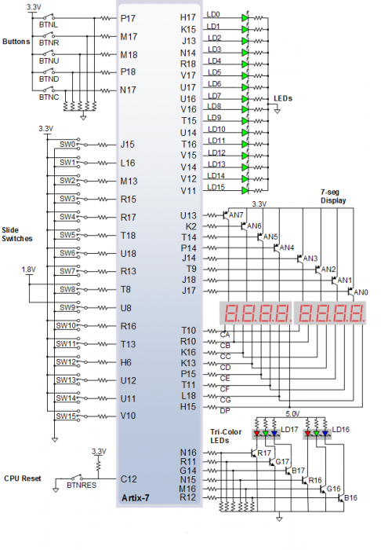

# LAB 8

## First task

### Completed state table

| **Input P** | `0` | `0` | `1` | `1` | `0` | `1` | `0` | `1` | `1` | `1` | `1` | `0` | `0` | `1` | `1` | `1` |
| :-- | :-: | :-: | :-: | :-: | :-: | :-: | :-: | :-: | :-: | :-: | :-: | :-: | :-: | :-: | :-: | :-: |
| **Clock** |  |  |  |  |  |  |  |  |  |  |  |  |  |  |  |  |
| **State** | A | A | B | C | C | D | A | B | C | D | B | B | B | C | D | B |
| **Output R** | `0` | `0` | `0` | `0` | `0` | `1` | `0` | `0` | `0` | `1` | `0` | `0` | `0` | `0` | `1` | `0` |

### Figure with connection of RGB LEDs on Nexys A7 board and completed table with color settings

| **RGB LED** | **Artix-7 pin names** | **Red** | **Yellow** | **Green** |
| :-: | :-: | :-: | :-: | :-: |
| LD16 | N15, M16, R12 | `1,0,0` | `1,1,0` | `0,1,0` |
| LD17 | N16, R11, G14 | `1,0,0` | `1,1,0` | `0,1,0` |



## Second task

### State diagram


### Listing of VHDL code of sequential process p_traffic_fsm with syntax highlighting

```vhdl

```

### Listing of VHDL code of combinatorial process p_output_fsm with syntax highlighting

```vhdl

```

### Screenshot(s) of the simulation, from which it is clear that controller works correctly


## Third task

### State table


### State diagram


### Listing of VHDL code of sequential process p_smart_traffic_fsm with syntax highlighting

```vhdl

```
